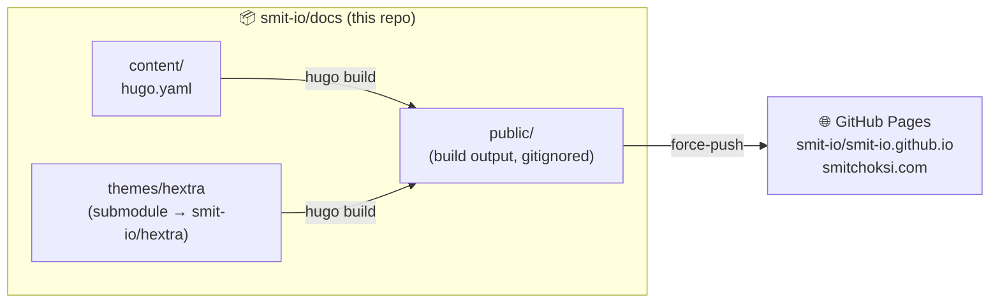

<div align="center">

# smitchoksi.com

**Personal knowledgebase — docs, projects, blogs and more.**

Built with [Hugo](https://gohugo.io) · themed with [Hextra](https://github.com/imfing/hextra) · published via [GitHub Pages](https://pages.github.com)

[**Visit the site →**](https://smitchoksi.com)

</div>

---

## How it works

This repo is the *source* of the website. The theme lives in its own repo,
pinned here as a git submodule — every commit on `main` is a full snapshot of
**content + theme**. The built site is plain (gitignored) output that CI
force-pushes to the Pages repo.



| Piece | Repo | Role |
|---|---|---|
| Content + config | [`smit-io/docs`](https://github.com/smit-io/docs) | Markdown, `hugo.yaml`, CI, tooling |
| Theme (fork) | [`smit-io/hextra`](https://github.com/smit-io/hextra) | Patched/extended Hextra — sole theme source |
| Built site | [`smit-io/smit-io.github.io`](https://github.com/smit-io/smit-io.github.io) | Rendered HTML, served at smitchoksi.com |

## Getting started

```bash
git clone git@github.com:smit-io/docs.git
cd docs
make submodules     # pull theme submodule
```

Then pick your context:

### 🐳 Devcontainer (recommended for writing)

Open in VS Code → **Reopen in Container**. Hugo, Go, Node, gh, act and make are
preinstalled. First time only: `gh auth login`.

```bash
make serve          # dev server → http://localhost:1313
make build          # build into smitchoksi.com/public/
```

### 💻 Host (macOS)

No Hugo needed — throwaway Docker containers do the work:

```bash
make docker-serve   # dev server → http://localhost:1313
make docker-build   # build into smitchoksi.com/public/
```

## Publishing (CI)

One workflow (`.github/workflows/publish.yml`), two ways to run it — both always
available (Actions are free on public repos):

- **Hosted (enabled)**: every push to `main` publishes automatically via GitHub
  Actions, authenticated by the `PUBLISH_TOKEN` fine-grained-PAT secret.
- **Local**: run the exact same workflow on your machine via
  [`act`](https://github.com/nektos/act), authenticated with your `gh` CLI token —
  no PAT, no secrets file.

```bash
make local-ci-dry   # rehearse: list steps, execute nothing
make local-ci-run   # publish FOR REAL: build → force-push to the Pages repo
```

The workflow: builds with Hugo → force-pushes `public/` as a single fresh commit
to `smit-io/smit-io.github.io` (no history accumulates, nothing is pushed back
to this repo). Full write-up on the site:
[/docs/site-publishing](https://smitchoksi.com/docs/site-publishing/).

<details>
<summary><b>Hosted CI controls</b></summary>

```bash
make gh-ci-status   # workflow state + recent runs
make gh-ci-run      # trigger a hosted run manually
make gh-ci-disable  # back to local-only (secret stays)
make gh-ci-enable   # re-enable push-to-main publishing
```

</details>

## Commands

Everything goes through `make` (or run `make help` in the terminal):

| Command | Context | What it does |
|---|---|---|
| `make help` | anywhere | List all commands, grouped by context |
| `make submodules` | anywhere | Init/update the theme submodule |
| `make serve` | 🐳 devcontainer | Hugo dev server at `http://localhost:1313` (native hugo) |
| `make build` | 🐳 devcontainer | Build the site into `smitchoksi.com/public/` (native hugo) |
| `make docker-serve` | 💻 host | Same dev server, via throwaway `hugomods/hugo` container |
| `make docker-build` | 💻 host | Same build, via throwaway container |
| `make local-ci-dry` | ⚡ local CI | Rehearse the publish workflow with `act -n` — lists steps, executes nothing |
| `make local-ci-run` | ⚡ local CI | **Publishes for real**: runs `publish.yml` via act — builds, force-pushes the site to the Pages repo. Auth = your `gh` token |
| `make gh-ci-enable` | ☁️ GitHub CI | Enable the hosted workflow — pushes to `main` publish automatically |
| `make gh-ci-disable` | ☁️ GitHub CI | Disable the hosted workflow — local CI keeps working |
| `make gh-ci-status` | ☁️ GitHub CI | Show workflow enabled/disabled state + last 5 hosted runs |
| `make gh-ci-run` | ☁️ GitHub CI | Trigger one hosted run manually (needs workflow enabled + `PUBLISH_TOKEN` secret) |

Guards are built in: wrong context gives a one-line hint (e.g. `serve` outside
the devcontainer tells you to use `docker-serve`), missing Docker or `gh` auth
fails fast with instructions.

## Everyday workflows

**✍️ Write content**

```bash
cd smitchoksi.com
hugo new docs/topic/page.md      # archetypes: default / docs / blog
make serve                       # live preview
make local-ci-run                # publish
```

**🎨 Patch the theme**

```bash
cd smitchoksi.com/themes/hextra
# edit, commit, push to smit-io/hextra
cd ../.. && git add themes/hextra && git commit -m "bump theme"
make local-ci-run
```

**⬆️ Pull upstream Hextra updates** — merge upstream into the fork, push, bump
the submodule SHA here, rebuild.

## Repo layout

```
.
├── .devcontainer/        # Hugo + Go + Node + gh + act + docker-cli toolchain
├── .github/workflows/    # publish.yml — build & deploy (run via act or hosted)
├── .vscode/              # settings + Hextra shortcode snippets
├── Makefile              # all commands — run `make help`
├── todo.md               # checklist to enable hosted CI
└── smitchoksi.com/       # Hugo site root
    ├── hugo.yaml         # site config (menus, search, fonts, analytics)
    ├── content/          # markdown (docs/, blog/, about/)
    ├── archetypes/       # templates for `hugo new`
    ├── assets/css/       # custom.css overrides
    ├── static/           # logo, favicons, fonts
    ├── themes/hextra     # ⎇ submodule — theme fork
    └── public/           # build output (gitignored) — force-pushed to Pages by CI
```

## Notes & gotchas

- The theme loads from `themes/hextra` only (no Hugo Modules) — intentional,
  the fork carries local patches.

## License

**All rights reserved.** See [LICENSE](LICENSE) — no copying, reuse, or
redistribution without written permission. The Hextra theme fork remains
under its upstream MIT license.
